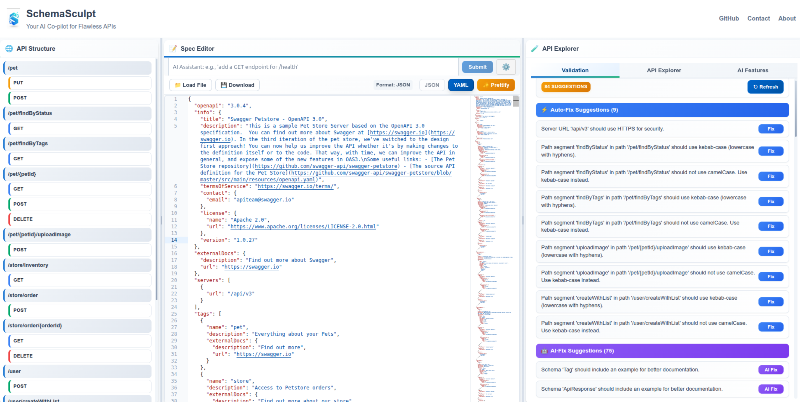
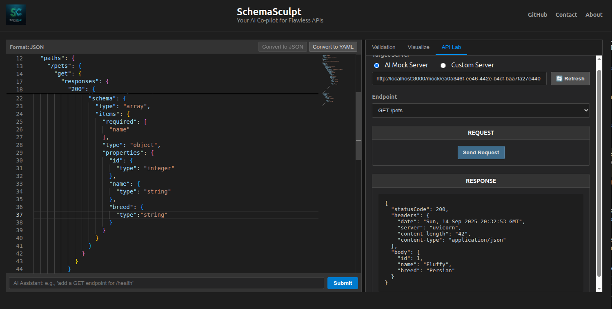
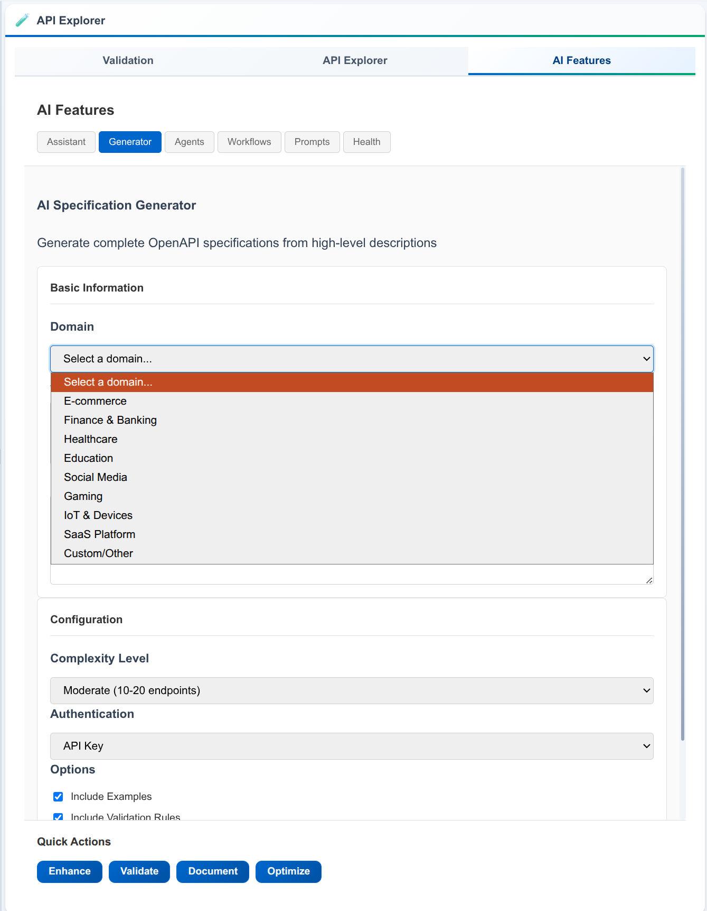
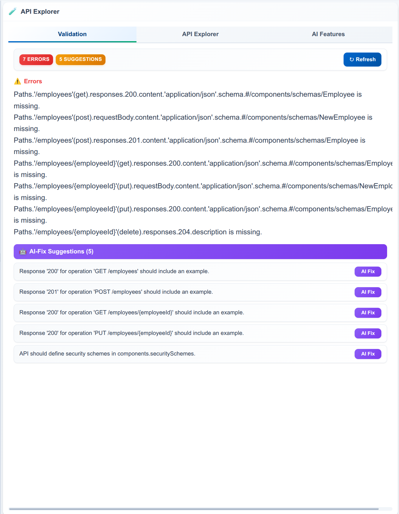
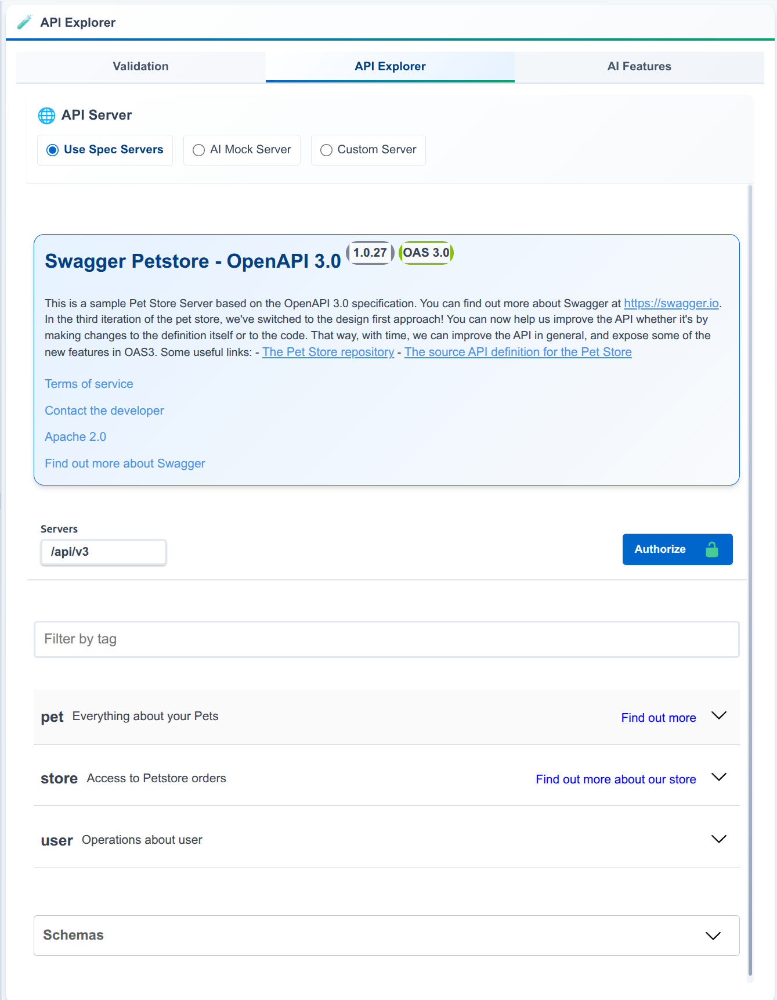

# SchemaSculpt 🗿

### Your AI Co-pilot for Flawless APIs

SchemaSculpt is an intelligent, locally-run assistant for crafting perfect API specifications. It goes beyond simple validation by providing smart suggestions, one-click fixes, and AI-powered editing to streamline your API design workflow.




## About The Project

Writing and maintaining OpenAPI specifications can be tedious. It's easy to make mistakes, leave unused components lying around, or forget best practices. SchemaSculpt was built to solve this problem by acting as your AI partner for API design.

It uses a powerful, locally-run LLM (via Ollama) to understand natural language commands, allowing you to edit and extend your API specs just by having a conversation. The built-in linter and quick-fix engine help you adhere to best practices and keep your specifications clean and maintainable.

## Key Features

* **🧪 Live API Lab & Testing**: Interactively build and send requests to any endpoint defined in your spec. Target either the built-in AI Mock Server or your own live server, all without leaving the editor.


* **🤖 AI-Powered Mock Server**: With a single click, spin up a mock server that uses an LLM to generate realistic, context-aware mock data on the fly. The server stays in sync with your latest changes via a "Refresh" button.
* **🤖 AI-Powered Editing**: Use natural language prompts (e.g., "add a GET endpoint for /health") to have a local LLM modify your API specification.


* **⚡ Real-time Validation**: Instantly see parsing and OpenAPI validation errors as you type.
* **💡 Intelligent Linter**: Get smart suggestions that go beyond basic validation, including:
    * Detecting unused component schemas.
    * Flagging operations with missing `summaries` or `tags`.
    * Enforcing `PascalCase` naming conventions for schemas.
    * Finding operations with a missing `operationId`.


* **🪄 One-Click Quick Fixes**: Automatically fix linter suggestions—like removing unused components or generating a missing `operationId`—with the click of a button.
* **👁️ Live Swagger UI Visualization**: Instantly see your API rendered in a beautiful, interactive documentation panel in a separate tab.


* **🔄 JSON <> YAML Conversion**: Seamlessly write in and convert between JSON and YAML formats with a single click.
* **✨ Modern UI**: A clean, professional, and resizable split-pane view that feels like a modern IDE.


## Tech Stack

| Frontend                | Backend (API Gateway)         | Backend (AI Service)         |
| :---------------------- | :---------------------------- | :--------------------------- |
| React                   | Java 21                       | Python 3                     |
| Monaco Editor           | Spring Boot 3                 | FastAPI                      |
| `react-resizable-panels`| Spring Boot WebSockets        | Ollama                       |
| `swagger-ui-react`      | Spring Boot Data Redis        | `prance`, `openapi-spec-validator` |
| `SockJS` & `StompJS`    | Spring Boot Webflux           | `httpx`                      |
| `axios` & `js-yaml`     | `swagger-parser`, JUnit 5     |                              |


## Getting Started

To get the full local environment running, you'll need to install the prerequisites and then start the four services in the correct order.

### Prerequisites

* **Java 21** (or higher) & **Maven**
* **Python 3.10+** & **Pip**
* **Node.js** & **npm**
* **Docker**
* **Ollama**: Download and install from [ollama.com](https://ollama.com)

### Step-by-Step Local Setup

Follow these steps in order, each in a **separate terminal window**.

#### **1. Start Redis**
This is our session cache. It needs to be running before the backend starts.
```bash
docker run -d --name schemasculpt-redis -p 6379:6379 redis
```
*To verify it's running, you can use `docker ps`.*

#### **2. Start the AI Model**
The local LLM must be running for the AI service to use it.
```bash
# First, ensure you have the model downloaded
ollama pull mistral

# Ollama runs as a background service, just ensure it's active.
# You can test it by running `ollama list`.
```

#### **3. Start the Python AI Service**
This service handles all AI-related tasks.
```bash
# Navigate to the ai_service directory
cd schemasculpt/ai_service

# Set up the environment (only needed the first time)
python3 -m venv venv
source venv/bin/activate
pip install -r requirements.txt

# Create your local environment file (only needed the first time)
cp .env.example .env 
# Now, edit the .env file and add your Hugging Face API token if needed.

# Run the server
uvicorn app.main:app --reload
```
*The AI service will start on `http://localhost:8000`.*

#### **4. Start the Java Backend**
This is the main API gateway.
```bash
# Navigate to the api directory
cd schemasculpt/api

# Run the server
./mvnw spring-boot:run
```
*The Java backend will start on `http://localhost:8080`.*

#### **5. Start the React Frontend**
This is the user interface.
```bash
# Navigate to the ui directory
cd schemasculpt/ui

# Install dependencies (only needed the first time)
npm install

# Run the development server
npm start
```
*Your browser will open to `http://localhost:3000`.*

You now have the complete SchemaSculpt application running locally!

## 🚀 Future Roadmap

The current features provide a powerful foundation. The vision is to continue making SchemaSculpt a more indispensable AI partner for developers:

* **AI-Powered Semantic Refactoring**: The next major feature. Enable the AI to suggest high-level architectural improvements, such as consolidating redundant schemas or standardizing path structures.
* **AI-Generated Test Cases**: Automatically generate a suite of "happy path" and "sad path" test cases that can be run from the API Lab.
* **Automated Documentation**: Generate high-quality `summary` and `description` fields for all parts of the spec based on context.


## Contributing

The kitchen is a bit of a mess right now, and the chef (that's me) is still trying to perfect the recipe. To avoid any unexpected explosions of code, I'm not accepting contributions just yet.

However, feel free to open an issue to share ideas or report bugs!

## License

This digital territory is currently an independent sovereignty with a benevolent dictator. A formal constitution (i.e., a license) is forthcoming.

Until then, all rights are reserved.
